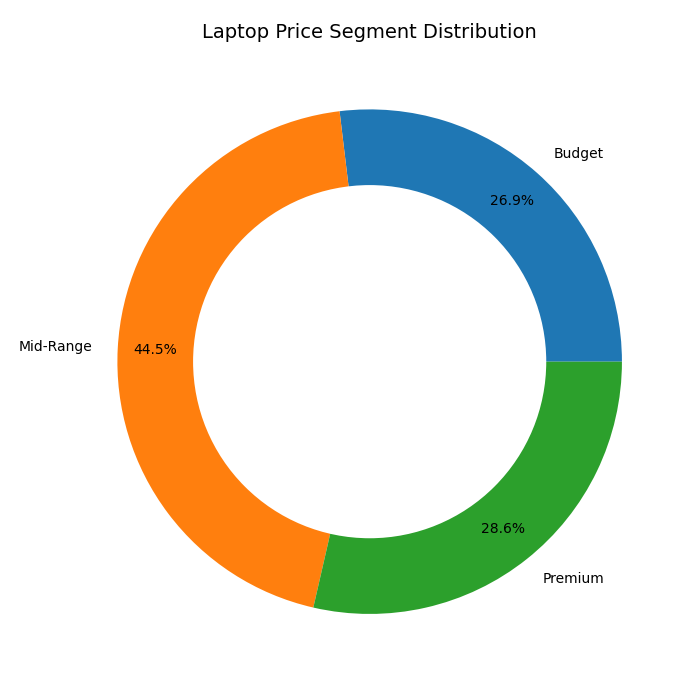
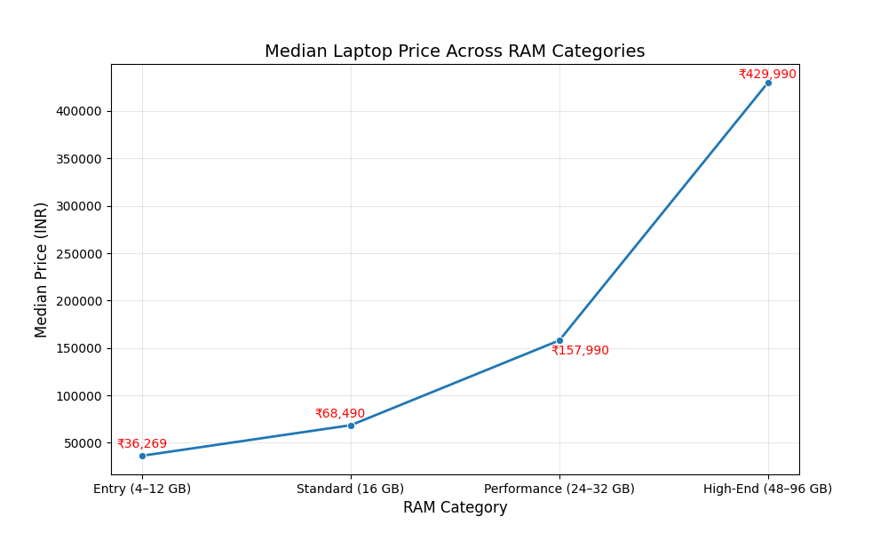
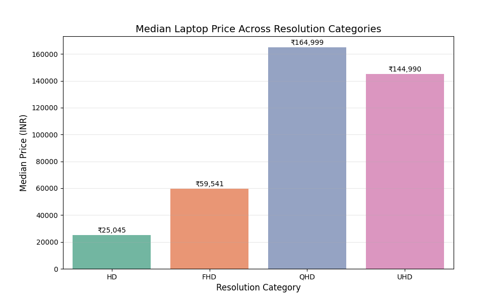
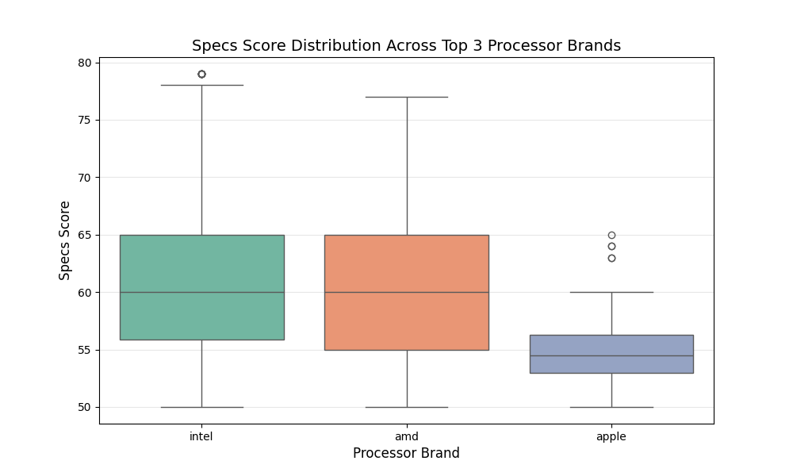
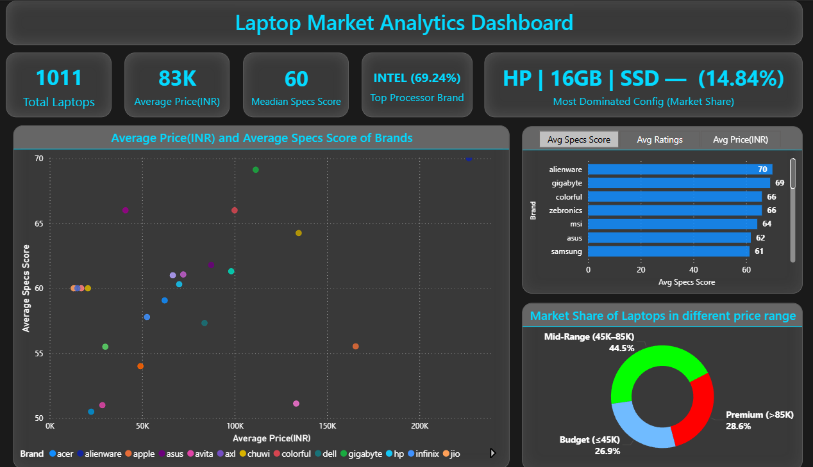

# Laptop Market & Performance Analysis (Python | Data Analytics)

An end-to-end data cleaning and exploratory analysis project based on a messy Kaggle laptop dataset. 

The original dataset contained incorrect values, inconsistent formats, missing entries, and noisy text fields.  

I first built a 750+ line cleaning script, then refactored it into a **200-line automated cleaning pipeline** using functions and rule-based transformations.

This project demonstrates my ability to work with **real-world messy data**, build reusable pipelines, and extract business insights responsibly.

---
## Tech Stack

- Python (pandas, numpy)

- Data Cleaning & Feature Engineering

- Exploratory Data Analysis (EDA)

- Matplotlib & Seaborn

- Statistical reasoning

---
## Key Steps

### **1. Data Cleaning & Refactoring**
- Removed impossible/incorrect values  
- Normalized CPU, RAM, storage, resolution, and GPU fields  
- Imputed missing values using context-aware logic  
- Combined redundant OS categories  
- Automated the pipeline using modular functions  

### **2. Feature Engineering**
Created analytical features including:
- `price_range`  
- `ram_bucket`  
- `resolution_grouped`  
- GPU classification (`is_igpu`, `has_dedicated_gpu`)  

---
## Data Quality Challenges Addressed

- Inconsistent text-based specifications (RAM, Storage, CPU, GPU)
- Mixed units and vendor-specific naming conventions
- Missing values in key hardware attributes
- Misleading categorical labels in OS and processor data
- Dataset bias toward gaming and premium configurations
  
---
## Key Insights from EDA

### 1) **Laptop Market Share according to Price Range**
  

- The laptop market is heavily concentrated in the mid-range and premium tiers.
- **Mid-range (45K–85K)** laptops dominate the market. This is showing a clear consumer shift toward higher performance and better build quality rather than low-cost devices.

### 2) **Price and RAM size relation**

 

- Laptop prices increase sharply with RAM capacity, with major jumps at 16GB and 32GB.
- This jump is indicating clear performance tiers and strong alignment between RAM configuration and customer segment.

### 3) Display quality strongly influences pricing (**QHD has highest median price**)
  

- Higher-resolution displays are strongly correlated with higher laptop prices.
- QHD laptops show the highest median price due to their association with gaming and creator-grade hardware.
- UHD models occupy the premium productivity segment.
- FHD represents the mainstream sweet spot, and HD remains confined to entry-level devices.

### 4) Box plot of top 3 Processor Brand

- Intel and AMD deliver nearly identical median specs scores, showing strong competition in the mainstream market.
- AMD exhibits wider performance variability, spanning budget to high-end models.
- Intel shows more high-performance outliers.
- Apple maintains consistent performance but in a narrower band, reflecting its premium ecosystem rather than raw hardware diversity.

### 5) Most common configuration: 
The top configuration, within this dataset, is **HP** with **16GB** RAM and **SSD** storage, appearing **150** times and accounting for **14.84%** of the market. 

### 6) GPU Market Share
**65.78%** of laptops feature a **dedicated GPU**, indicating a strong gaming/creator bias in the sampled market. 

---
## Laptop Market Analysis Dashboard

This repository contains the interactive Power BI dashboard used to analyze key trends, brand performance, and pricing strategies within the laptop market.

---

## Dashboard Summary

The analysis focuses on providing a data-driven view of the laptop landscape, highlighting areas of opportunity and risk. Key insights available in the report include:

* **Market Segmentation:** A breakdown of market share across different price ranges (Budget, Mid-Range, Premium).
* **Value Proposition Analysis:** A scatter plot comparing Average Price vs. Average Specs Score by brand to identify high-value performers.
* **Performance Deep Dive:** Analysis of average pricing, specifications, and ratings per brand via an interactive bar chart.
* **Processor Dominance:** Identification of the top processor brand and its overall market share.

---

## Accessing the Report File

The primary Power BI file is available for download. To inspect the data model, measures, and calculated columns, please open this file using Power BI Desktop.

| File Name | Description |
| :--- | :--- |
| `Laptop_Market_Analysis_Dashboard.pbix` | The main Power BI Desktop report. |

---
## Ethical Analysis Note

Several additional analyses were explored but intentionally excluded due to data incompleteness and imbalance.

Example: A rule-based “high performance threshold” initially classified a ₹23,887 laptop as high-performance due to incorrect CPU thread metadata in the Kaggle dataset.
This insight was intentionally discarded, demonstrating responsible analytical judgment.

Similarly, OS rating analysis was skipped due to extreme imbalance (930 Windows vs <40 macOS vs <10 others).

(*“No analysis is better than wrong analysis.”*)

---
## Author

**Debayan Mal**  
Data Analyst — Python | SQL | Statistics | Visualization  
LinkedIn: https://linkedin.com/in/debayan-mal-9a3479340

